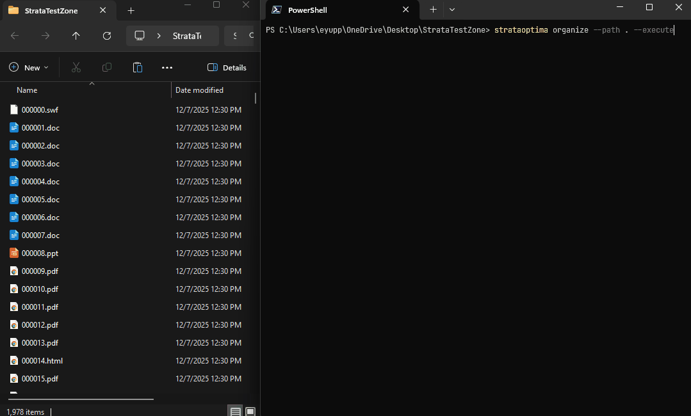

# StrataOptima

A high-performance CLI tool for organizing messy directories. It detects duplicate files by content, categorizes files by type, and cleans up disk space.

---



---

## ✨ Features

- **🔍 Deep Duplicate Detection:** Calculates MD5/SHA-256 hashes to find identical files even if they have different names (e.g., `thesis.pdf` and `thesis (1).pdf`).

- **📂 Smart Categorization:** Automatically sorts files into clean, logical folder structures:

  - `Images/`, `Documents/`, `Videos/`, `Audio/`, `Archives/`, `Code/`, `Applications/`

- **🛡️ Dry-Run Safety First:** Runs in "Simulation Mode" by default. It shows you exactly what *would* happen without touching a single file until you say so.

- **⚡ High Performance:** Powered by Kotlin Coroutines and Java NIO to process thousands of files concurrently.

- **💥 Collision Handling:** Smartly renames files (`file_1.jpg`) to prevent data loss during organization.

---

## 🚀 Getting Started

### Prerequisites

- **Java JDK 21** installed.

### Build from Source

Clone the repository and build the project using the Gradle Wrapper:

```bash
git clone https://github.com/eyuppastirmaci/strata-optima.git
cd strata-optima
./gradlew build
```

### Installation as a Global Command

To run strataoptima from any terminal window without using Gradle, follow these steps:

#### 1. Generate the Distribution

First, create the executable files:

```bash
./gradlew installDist
```

This creates the binaries in `build/install/StrataOptima`.

#### 2. Setup for your OS

##### Windows

1. Move the generated folder `build\install\StrataOptima` to a permanent location (e.g., `C:\Tools\StrataOptima`).
2. Add the `bin` folder path (e.g., `C:\Tools\StrataOptima\bin`) to your System PATH environment variable.
   - Search "Edit the system environment variables" -> Environment Variables -> System variables -> Path -> Edit -> New.
3. Restart your terminal (PowerShell/CMD).

##### Linux / macOS

1. Move the generated folder to a permanent location:

```bash
mv build/install/StrataOptima $HOME/strataoptima
```

2. Add the `bin` directory to your PATH in `.bashrc` or `.zshrc`:

```bash
export PATH="$HOME/strataoptima/bin:$PATH"
```

3. Refresh your shell configuration:

```bash
source ~/.bashrc  # or source ~/.zshrc
```

---

## 📖 Usage

Once installed globally, you can run the tool from anywhere:

### 1. Help Command

View available commands and options:

```bash
strataoptima --help
```

### 2. Analyze Command

Scan a directory to see statistics, identify duplicates, and calculate wasted disk space without moving any files.

```bash
strataoptima analyze --path "C:\Users\User\Downloads"
```

**Example Output:**
```text
Analyzing: C:\Users\User\Downloads

Analysis Results
----------------
Total files:       5,790
Total size:        13.96 GB

Duplicates
----------
Duplicate groups:  299
Duplicate files:   396
Wasted space:      251.61 MB
```

### 3. Organize Command

Sorts files into categorized folders.

**How it works:**
- If you specify a `--target` directory, files will be moved to that location.
- If you don't specify `--target`, the program creates an `organized` folder inside the source directory and moves files there.

#### A. Dry-Run (Simulation) - *Default*

By default, this command **will not move files**. It simulates the operation and reports what would happen.

**Without target (default behavior):**
```bash
strataoptima organize --path "C:\Users\User\Downloads"
```

**With custom target:**
```bash
strataoptima organize --path "C:\Users\User\Downloads" --target "C:\Users\User\Desktop\Archive"
```

**Output Preview:**
```text
Mode: DRY-RUN (simulation only)
Source: .../Downloads
Target: .../Downloads/organized

[->] holiday.jpg -> Images\holiday.jpg
[->] invoice.pdf -> Documents\invoice.pdf
[->] setup.exe   -> Applications\setup.exe

Summary
-------
Would organize: 5790 files
Run with --execute to apply these changes
```

#### B. Execute (Real Action) ⚠️

To actually move the files and organize your disk, add the `--execute` flag.

**Example 1: Organize to a custom target directory**
```bash
strataoptima organize --path "C:\Users\User\Downloads" --target "C:\Users\User\Desktop\Archive" --execute
```

Or using short flags:
```bash
strataoptima organize -p "C:\Users\User\Downloads" -t "C:\Users\User\Desktop\Archive" -e
```

**Example 2: Organize to default location (creates `organized` folder in source)**
```bash
strataoptima organize --path "C:\Users\User\Downloads" --execute
```

*Note: If you haven't installed the tool globally, replace `strataoptima` with `./gradlew run --args="..."` in the commands above.*

---

## 🛠️ Tech Stack & Architecture

StrataOptima is built with a focus on clean architecture and type safety.

- **Language:** Kotlin (1.9+)
- **Concurrency:** Kotlin Coroutines
- **CLI Framework:** Clikt

---

## 🧪 Running Tests

The project includes a comprehensive test suite covering file detection, hashing algorithms, and organization logic.

```bash
# Run all tests
./gradlew test

# Run with verbose logging
./gradlew test --info
```

